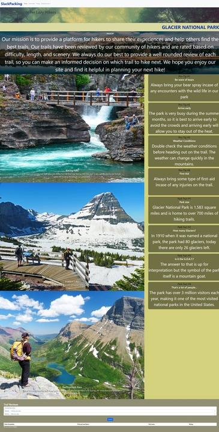

# Slackpacking
A trail guide for lazy hikers

## Description
This project is an interactive website that allows hikers to explore different trails in Glaicer National Park. With varying difficulties from easy to expert and descriptions of the trails. The website also allows the user to review the trail and mark it completed in a forum section.

## Visuals

## Application
https://d-wargle.github.io/First-Project/

## Built with
- [Bootstrap](https://getbootstrap.com/docs/5.3/getting-started/introduction/)
- [VScode](https://code.visualstudio.com/)

## Usage
When looking at the website you can see different sections including a header with a dropdown bar. Underneath the header section uthere are three different sections for easy,moderate, and expert level trails. You can scroll through the different images so that you can see the different trails there is to offer. Looking to the side of the trail images you can see facts and information about the park itself.

## Roadmap
The way to take this website further is to add more parks with the same website built for them and have them linked into this website. As well as adding pricing for camping, parking, and more interactive data tracking in the forum. 

## Authors 
* Daniel Wargo
* Nic Miller

## Credits
N/A

## License
Please refer to the LICENSE in the repo.

